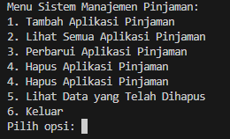
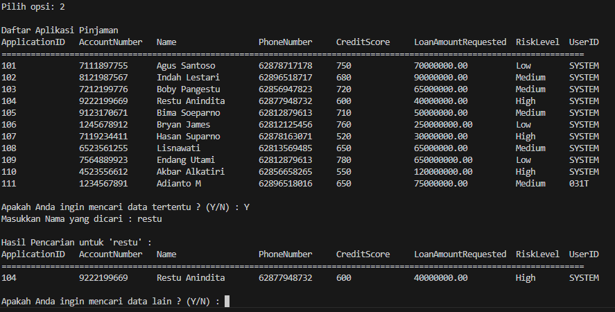

# project_data_science

# Loan Management System

## Introduction
Dalam industri perbankan, pengelolaan data nasabah merupakan salah satu aspek yang sangat penting, salah satunya adalah data permohonan peminjaman. Pengelolaan data permohonan pinjaman ini harus dilakukan dengan hati-hati dan sistematis, karena dalam industri perbankan data nasabah adalah data yang bersifat sangat rahasia. Oleh karena itu, diperlukan sistem yang dapat menyimpan dan mengelola data tersebut secara terorganisir dan aman (tidak semua orang memiliki akses).

Sistem Manajemen Pinjaman (Loan Management System) ini dibangun untuk memberikan gambaran tentang bagaimana sistem perbankan bekerja, terutama pada sistem pengelolaan data nasabah. Selain itu, proyek ini dibuat dengan tujuan untuk membantu bank atau lembaga keuangan dalam mengelola permohonan pinjaman nasabah dengan lebih efisien dan aman. Sistem ini tidak hanya memfasilitasi pengelolaan data nasabah, tetapi juga memastikan bahwa informasi penting seperti nomor rekening, skor kredit, dan rincian pinjaman tetap terjaga keamanannya. Dengan adanya sistem ini, diharapkan proses pengelolaan data pinjaman menjadi lebih cepat, transparan, dan aman.

## Fitur Utama
- **Login:** Memungkinkan user untuk masuk dengan ID dan password yang memiliki akses pada sistem. Fitur ini menjamin keamanan akses ke sistem.
- **Create:** Menambahkan Aplikasi Pinjaman.
- **Read:** Melihat semua Aplikasi Pinjaman.
- **Update:** Memperbarui data Aplikasi Pinjaman.
- **Delete:** Menghapus Aplikasi Pinjaman.

## Fitur Tambahan
- **Pencarian Data:** Memungkinkan user untuk mencari data pinjaman berdasarkan kriteria tertentu.
- **Manajemen Nomor Rekening:** Nomor rekening otomatis terisi secara berurutan saat menambahkan data baru dan memeriksa duplikasi.
- **Validasi Input:** Menjamin bahwa input yang diberikan sesuai dengan format yang benar dan validasi dilakukan sebelum transaksi (Create, Update, Delete).

## Cara Kerja Program

### 1. Login
Ketika program dijalankan, tampilan awal adalah fitur login yang meminta user untuk login dengan `user_id` dan `password` yang valid. Dalam fitur login ini, jika user memasukkan `user_id` dan `password` yang tidak sesuai, program akan memberikan opsi untuk mencoba login kembali atau keluar dari program.

Tampilan login:

Dalam program ini saya sudah mengimport library getpass, yang mana berfungsi untuk tidak menampilkan password yang diinput oleh user.
Dalam fitur login ini, ketika user memasukkan user id dan pass yg tidak sesuai, maka program akan memberikan opsi ingin login kembali atau tidak, ketika memilih Y maka program akan meminta user untuk menginput kembali user_id dan password yang valid, jika user memilih N, maka program akan keluar secara otomatis. Berikut Code yang telah Saya buat :

### 2. Menu Utama
Setelah user berhasil Login, maka program akan langsung menampilkan menu utama yg terdiri dari 6 opsi, dan program akan langsung meminta user untuk memilih salah satu dari opsi yang ditampilkan.
Berikut menu utama yang ditampilkan:

### 3. Tambah Aplikasi Pinjaman (Fitur Create)
Dalam fitur Create, user diminta untuk menginput data aplikasi pinjaman baru, seperti:
1. Nomor Rekening
2. Nama Pemohon
3. Nomor Telepon
4. Skor Kredit
5. Jumlah Pinjaman

Program ini saya telah ditentukan data nomor rekening adalah data yang identic, jadi ketika user menginput data nomor rekening yang sama dengan data yang telah tersimpan pada system, maka program akan mengeluarkan output keterangan bahwa nomor rekening sudah terdaftar, dan memberikan opsi apakah ingin menambahkan norek yang lain, atau ingin melakukan update data. Jika memilih input rekening baru, maka program akan looping kembali dan meminta user untuk input norek lain. Namun jika User memilih update data, maka program akan membawa ke tampilan update data. Kemudian, untuk data nomor telepon, Credit Score dan jumlah pinjaman saya buat harus dengan format number, jika tidak program akan meminta user untuk menginput kembali dengan format yg sesuai. Setelah User selesai input data, program akan menampilkan semua data yang telah diinput dan meminta konfirmasi kepada user apakah yakin ingin menambahkan aplikasi atau tidak, jika Y, maka data berhasil disimpan, dan jika N maka data batal disimpan dan kembali ke Menu Utama.

Kode Create:

Output create :

Informasi tambahan :
Application ID, dalam program telah saya buat akan terisi secara otomatis berurut +1 dari application ID terbaru data sebelumnya.
Level Risiko, dalam program telah saya buat 3 level dengan ketentuan:
-	Low, Skor kredit >= 750
-	Medium, 650 <=Skor kredit< 750 
-	High, Skor kredit < 650

### 4. Melihat Semua Aplikasi Pinjaman (Fitur Read)
Pada menu Read, semua data aplikasi pinjaman akan ditampilkan dalam bentuk tabular. User juga bisa melakukan pencarian berdasarkan nama pemohon.
Code Fitur Read :

Code Fitur Search :

Output Fitur Read :

### 5. Perbarui Aplikasi Pinjaman (Fitur Update)
Pada fitur Update, user diminta untuk menginput Application ID yang ingin diperbarui. Jika ditemukan, program akan menampilkan data terkait dan memungkinkan user untuk memilih kategori yang akan di-update.
Jika user ingin melakukan update pada kategori Account Number, dalam program dibuat bahwa account number harus bersifat identic. Jadi jika user menginput nomor rekening yang sudah ada dalam system, maka program akan mengeluarkan output nomor rekening sudah terdaftar dalam system dan mengembalikan ke menu utama. Begitu juga dengan Credit Score akan secara otomatis mengupdate risk level sesuai dengan ketentuan. Setelah update data dilakukan, program akan meminta validasi kepada user apakah yakin ingin dilakukan update data? jika Y akan memanggil userID yang melakukan update dan secara otomatis mengupdate pada kolum user id.
Tampilan Sebelum update:

Gambar output update :

### 6. Hapus Aplikasi Pinjaman (Fitur Delete)
Untuk fitur Delete, program akan meminta user untuk menginput Application ID yang akan dihapus. Data yang dihapus akan disimpan di list `deleted_loan` dan userID yang melakukan transaksi akan tercatat.
Kode Delete :

gambar output delete

### 7. Lihat Data yang Telah Dihapus
Fitur ini menampilkan semua data yang telah dihapus dan tersimpan di `deleted_loan` dalam bentuk tabular dengan userID yang telah terupdate dengan userID yang melakukan transaksi hapus data.
Tampilan data yang telah dihapus :

## Kontribusi
Jika Anda ingin berkontribusi pada proyek ini, silakan fork repositori dan kirimkan pull request. Semua kontribusi dan saran sangat diterima.

## Kontak
Jika Anda memiliki pertanyaan atau feedback, silakan hubungi saya melalui email di irfanmaulanaysuf47@gmail.com atau melalui [LinkedIn](https://www.linkedin.com/in/irfanmaulanayusuf).
